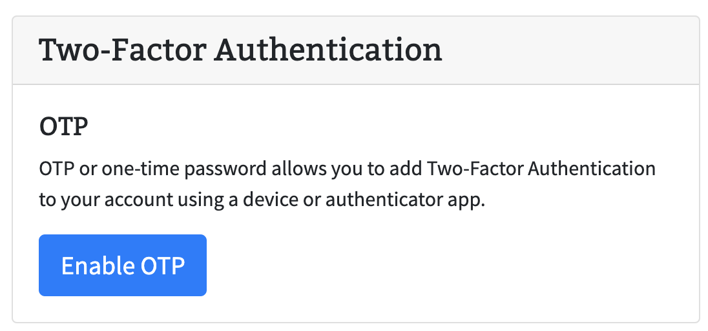
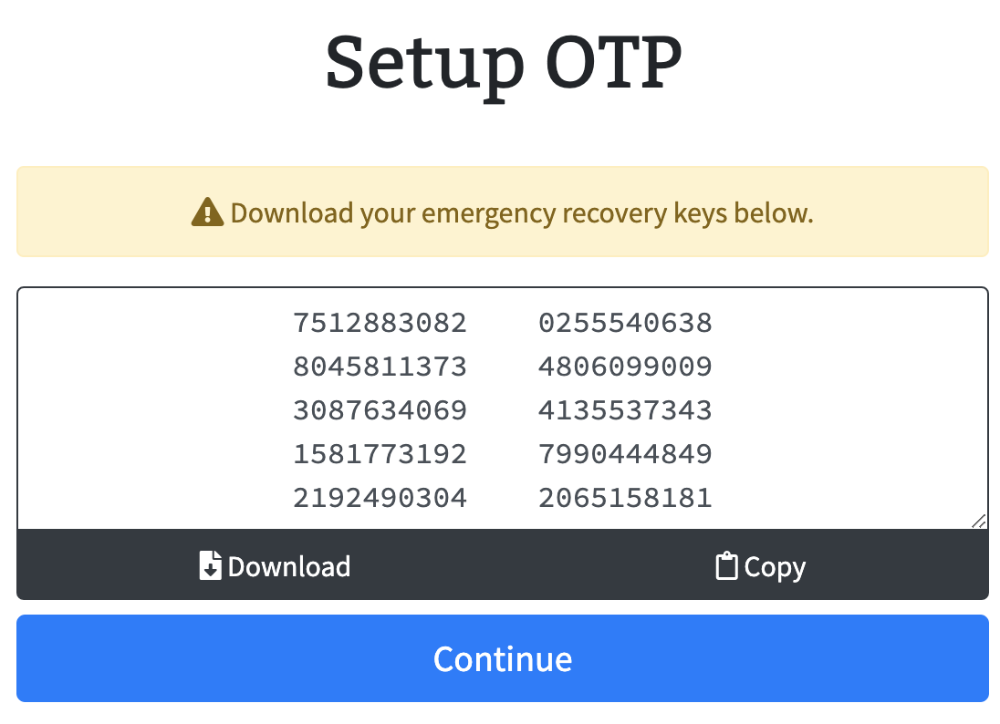
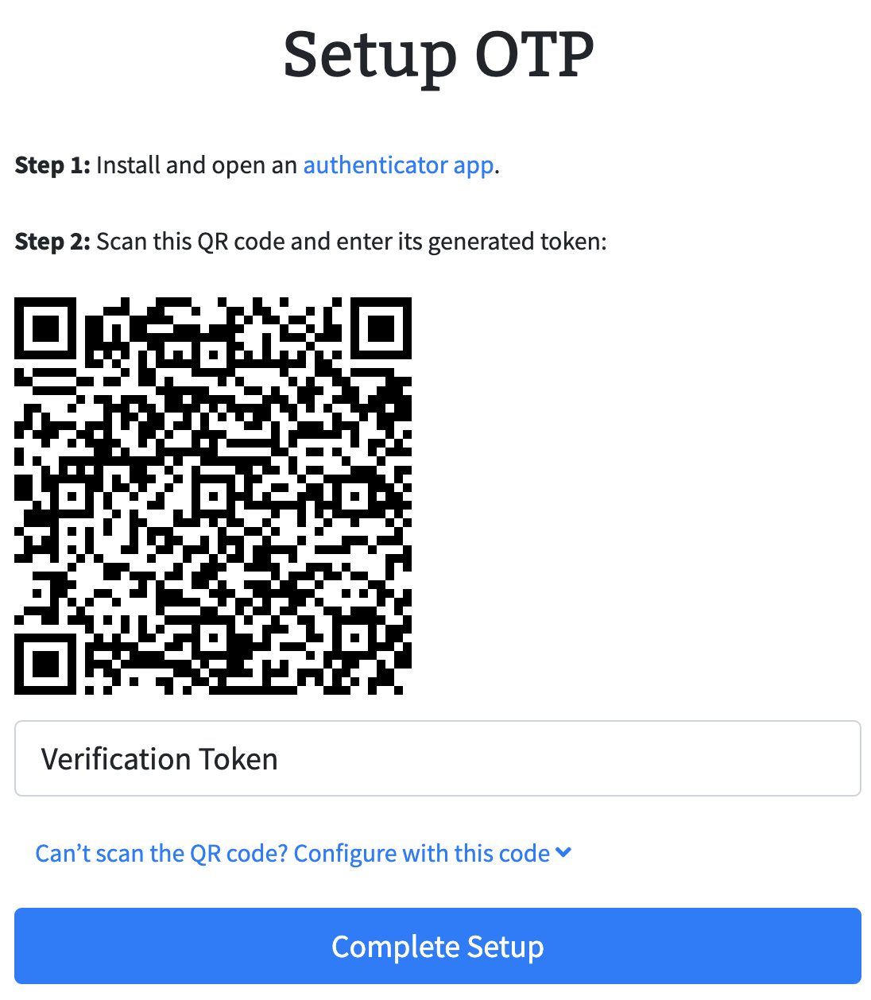

> ##### **TLDR; `AUTH_OTP_ENABLED = true` in `.env`. Done.**

If you're reading this and are unfamiliar with [Lad](https://github.com/ladjs/lad) be sure to take a moment to check out the [Getting Started](https://github.com/ladjs/lad#get-started) pages as well as the [feature list](https://github.com/ladjs/lad#features). It's an amazing, full featured node.js framework that allows you to turn on features via configuration.

In this article (more so recipe), we'll look at turning on 2FA using OTP with a single line of code. We'll also take a look at what this gives us and how this works.

_Note: From here on out, it is expected that you have scaffolded a lad.js app using lad or have an existing app and are comfortable with the [project structure](https://github.com/ladjs/lad#architecture)._

## Enable OTP in lad.js

Lad.js environment configuration (`.env`) allows us to turn on and off features. You can see the defaults in [`.env.defaults`](https://github.com/ladjs/lad/blob/master/template/.env.defaults) for reference. One of these features is OTP (one-time passcode) that we can simply turn on by adding `AUTH_OTP_ENABLED=true`. That's it. 2FA is enabled and we get a full stack enhancement to our application. Let's take a deeper look at what we get and how this works.

## User point-of-view

After enabling OTP on the app, the user can sign up / sign in through normal flow. Navigate to "My Account" and under "Security" section the user will now see a "Enable Two-Factor Authentication" button.

Clicking on the "Enable Two-Factor Authentication" button will start the onboarding process to enable 2FA. A modal will appear showing information around otp recovery keys. The modal has options to copy or download the keys to store in a safe place.

Continuing from here allows the user to use their favorite authenticator app and either scan the QR code or input directly in authenticator app for easy OTP setup. The application expects the user to verify one of the otp passcodes from the app before officially enabling 2FA.

## How does this work behind the scenes?

[Lad.js](https://github.com/ladjs/lad) takes advantage of a couple of important modules for enabling OTP:

* [`passport-otp-strategy`](https://github.com/ejhayes/passport-otp) - passport middleware to authenticate a user's otp value against a secret
* [`otplib`](https://github.com/yeojz/otplib) - RFC compliant OTP library
* [`qrcode`](https://github.com/soldair/node-qrcode) - QR code generation

Each user gets a secret token that is saved in mongo upon loading their security page. When the user chooses to enable 2FA, they are presented with a set of randomly generated recovery keys that they are able to download. These recovery keys are saved with the user details along with the secret otp token. We leverage [`otplib`](https://github.com/yeojz/otplib) to generate the otp URI along with [`qrcode`](https://github.com/soldair/node-qrcode) to create a QR code of this otp URI. Authenticator applications understand the format of these otp URIs and use this to fill the details in your application. This allows the user to simply scan the QR code and see the details populate within their authenticator application.

Now, as a 2FA enabled user logs in, [`passport-otp-strategy`](https://github.com/ejhayes/passport-otp) middleware will validate if the user has logged in as well as verified their otp passcode. If not, the app will display a "verify 2FA" token page that allows the user to obtain and input the current OTP passcode to authenticate and get into their account.

## Conclusion

Thanks for reading! If you see issues with lad.js do open up an [issue in github](https://github.com/ladjs/lad/issues/new). And do join us in slack at <https://ladjs.slack.com>
