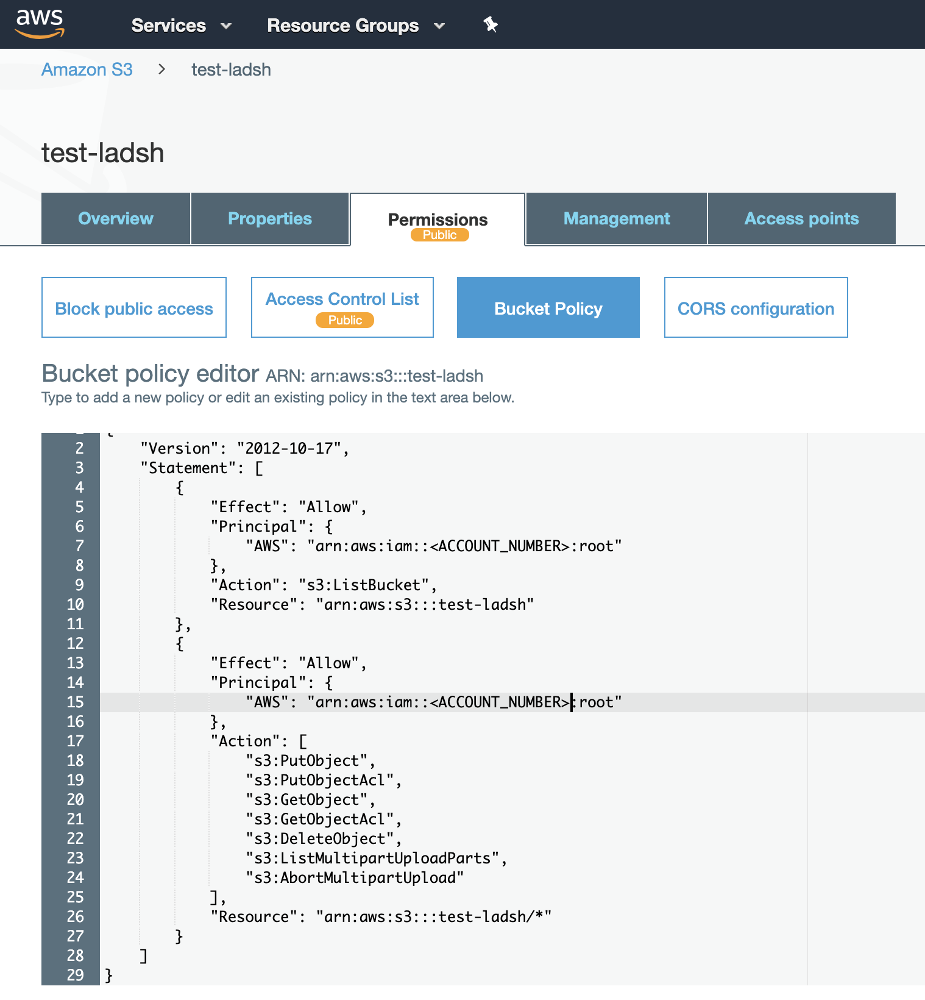
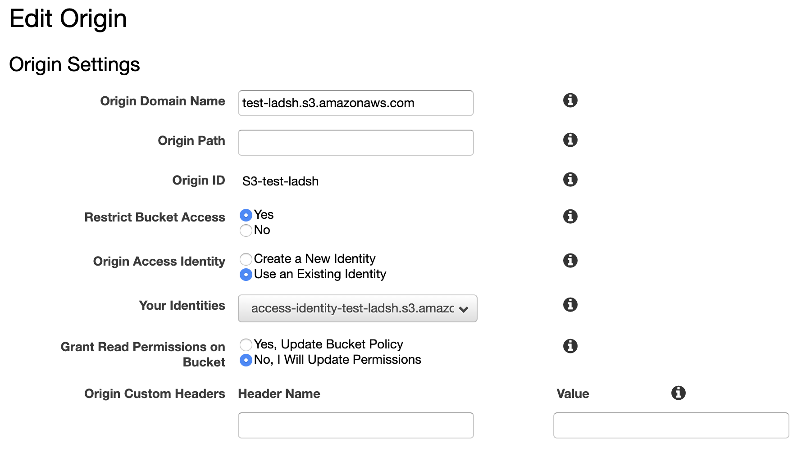
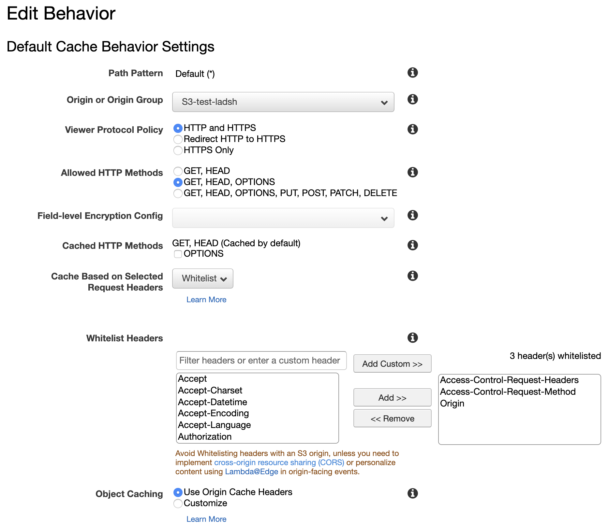

## Overview

This guide runs through amazon s3 and cloudfront setup and configuration to utilize for application asset upload (to s3) and CDN delivery (from cloudfront).

_NOTE: This guide does not contain any application integration._


## Table of Contents

* [Setup S3](#setup-s3)
  * [S3 Getting started](#s3-getting-started)
  * [S3 Settings](#s3-settings)
* [Setup Cloudfront](#setup-cloudfront)
  * [Cloudfront Getting Started](#cloudfront-getting-started)
  * [Cloudfront configuration](#cloudfront-configuration)
  * [Origin settings](#origin-settings)
  * [Cache behavior settings](#cache-behavior-settings)
* [Conclusion](#conclusion)


## Setup S3

### S3 Getting started

If you are new to AWS S3, checkout the [S3 Getting Started](https://docs.aws.amazon.com/AmazonS3/latest/gsg/GetStartedWithS3.html) guide which will take you through:

* [Setting up s3](https://docs.aws.amazon.com/AmazonS3/latest/gsg/SigningUpforS3.html)
* [Creating a bucket](https://docs.aws.amazon.com/AmazonS3/latest/gsg/CreatingABucket.html)
* [Uploading an object to a bucket](https://docs.aws.amazon.com/AmazonS3/latest/gsg/PuttingAnObjectInABucket.html)
* ...etc.

### S3 Settings

#### Bucket policy

S3 bucket policy enables authentication and authorization using amazons IAM (Identity and Access Management) policies. This allows you, at a granular level, to enforce what accounts can do what actions on what S3 buckets.

<br />

**Example policy**

```
{
    "Version": "2012-10-17",
    "Statement": [
        {
            "Effect": "Allow",
            "Principal": {
                "AWS": "arn:aws:iam::<ACCOUNT_NUMBER>:root"
            },
            "Action": "s3:ListBucket",
            "Resource": "arn:aws:s3:::test-ladsh"
        },
        {
            "Effect": "Allow",
            "Principal": {
                "AWS": "arn:aws:iam::<ACCOUNT_NUMBER>:root"
            },
            "Action": [
                "s3:PutObject",
                "s3:PutObjectAcl",
                "s3:GetObject",
                "s3:GetObjectAcl",
                "s3:DeleteObject",
                "s3:ListMultipartUploadParts",
                "s3:AbortMultipartUpload"
            ],
            "Resource": "arn:aws:s3:::test-ladsh/*"
        }
    ]
}
```

<br />
<br />

**Example visual**



<br />
<br />

#### CORS configuration

**Example configuration**

```
<?xml version="1.0" encoding="UTF-8"?>
<CORSConfiguration xmlns="http://s3.amazonaws.com/doc/2006-03-01/">
  <CORSRule>
      <AllowedOrigin>*</AllowedOrigin>
      <AllowedMethod>GET</AllowedMethod>
      <AllowedMethod>HEAD</AllowedMethod>
      <AllowedHeader>*</AllowedHeader>
  </CORSRule>
</CORSConfiguration>
```

<br />

**Example visual**


## Setup Cloudfront

Cloudfront is amazon's CDN (content delivery network) offering. Cloudfront hosts servers all around the world distribute and cache your assets so that you are as close to your users as possible.

### Cloudfront Getting Started

If you are new to AWS Cloudfront, checkout the [Setting up](https://docs.aws.amazon.com/AmazonCloudFront/latest/DeveloperGuide/setting-up-cloudfront.html) and [Getting Started](https://docs.aws.amazon.com/AmazonCloudFront/latest/DeveloperGuide/GettingStarted.html) guides.

### Cloudfront configuration

### Origin settings

Cloudfront origin settings point cloudfront to your S3 origin where content is served from and then distributed and cached



### Cache behavior settings

Cloudfront cache behavior settings tell cloudfront what and how to cache. Including the origin where assets live and what headers to honor and forward to your users. This is very important to get CORS to work.

#### Options

* **Allowed HTTP methods:** GET, HEAD, OPTIONS
* **Cache Based on Selected Request Headers:** Whitelist
* **Whitelist Headers:**
  * Origin
  * Access-Control-Requests-Headers
  * Access-Control-Requests-Method




## Conclusion

This concludes a simple guide to setup amazon s3 for asset storage and amazon cloudfront for CDN delivery of those assets. I hope you found this useful!
